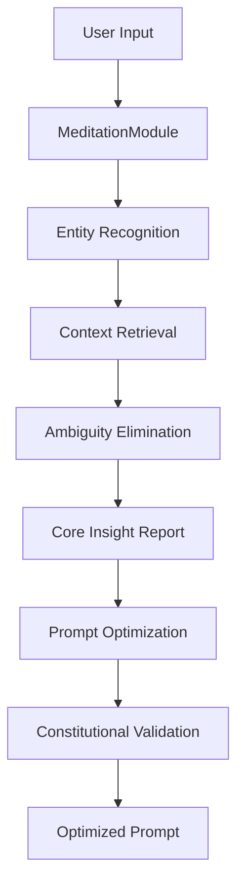
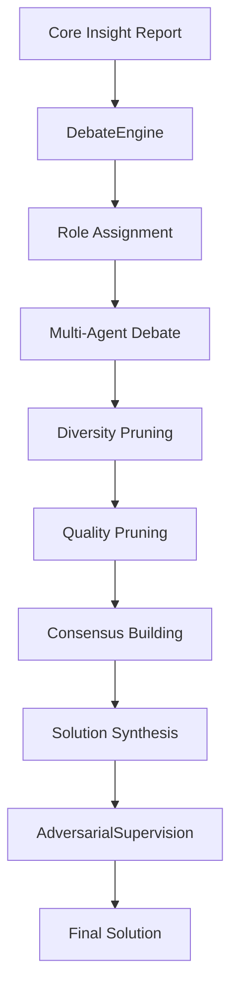
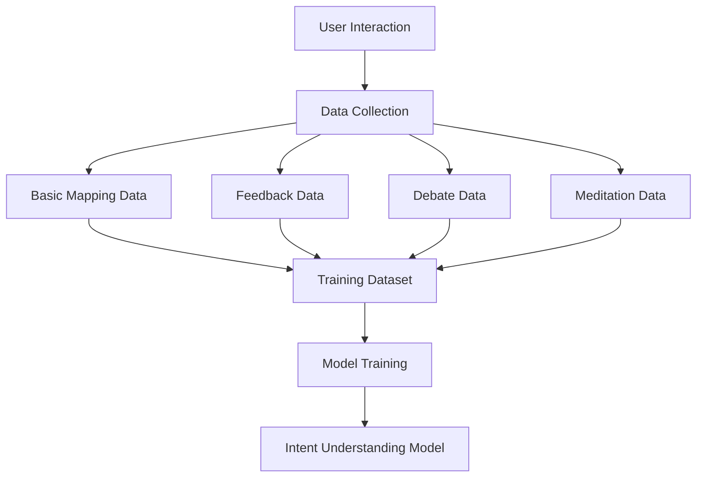

# Hermes AI - System Design Document

## 🏗️ System Architecture Overview

Hermes AI is designed as a **multi-agent system** focused on **human-AI intent alignment**. The architecture follows a layered approach with universal intent understanding at the bottom, domain adaptation in the middle, and specific applications at the top.

## 🎯 Core Design Principles

### 1. **Intent Alignment First**
- Every component is designed to enhance human-AI intent alignment
- All interactions are logged and analyzed for training data
- Continuous learning from human feedback and corrections

### 2. **Multi-Agent Collaboration**
- Clear role separation: Developer, Reviewer, Constitution Supervisor
- Adversarial debate for comprehensive problem solving
- Emergent intelligence through agent interaction

### 3. **Constitutional Governance**
- All outputs must pass constitutional validation
- Self-critique and revision process for quality assurance
- Ethical guidelines enforcement at system level

### 4. **Universal Migration Capability**
- Abstract patterns from software development domain
- Transfer learning to other domains (medical, legal, education)
- Mind-reading level understanding as ultimate goal

## 🏛️ System Architecture

### **Layer 1: Universal Intent Understanding (底层)**
```
┌─────────────────────────────────────────────────────────────┐
│                Universal Intent Understanding               │
├─────────────────────────────────────────────────────────────┤
│  • Intent Understanding Engine (Universal)                 │
│  • Multi-Role Collaboration Framework (Universal)          │
│  • Feedback Learning Mechanism (Universal)                 │
│  • Mind-Reading Perception Module (Advanced)               │
└─────────────────────────────────────────────────────────────┘
```

### **Layer 2: Domain Adaptation (中层)**
```
┌─────────────────────────────────────────────────────────────┐
│                    Domain Adaptation Layer                  │
├─────────────────────────────────────────────────────────────┤
│  • Medical Domain Adapter    • Educational Domain Adapter  │
│  • Legal Domain Adapter      • Business Domain Adapter     │
│  • Software Development Adapter (Training Vehicle)         │
└─────────────────────────────────────────────────────────────┘
```

### **Layer 3: Application Layer (顶层)**
```
┌─────────────────────────────────────────────────────────────┐
│                      Application Layer                      │
├─────────────────────────────────────────────────────────────┤
│  • Medical Diagnosis Assistant                             │
│  • Educational Planning Assistant                          │
│  • Legal Analysis Assistant                                │
│  • Business Decision Assistant                             │
│  • Software Development Assistant (Primary)                │
└─────────────────────────────────────────────────────────────┘
```

## 🔧 Core Modules Architecture

### **1. MeditationModule (禅定模块)**
```python
class MeditationModule:
    """
    Problem framing and deep analysis module
    Breaks through conventional thinking patterns
    """
    
    async def frame_problem(self, user_input: str) -> CoreInsightReport:
        """Transform vague commands into structured problem definitions"""
        pass
    
    async def break_patterns(self, context: Dict) -> List[Insight]:
        """Generate higher-dimensional insights"""
        pass
```

**Key Features:**
- Entity recognition and context retrieval
- Ambiguity elimination through clarification
- Constraint and objective definition
- Pattern breaking for creative solutions

### **2. DebateEngine (对抗性辩论引擎)**
```python
class DebateEngine:
    """
    Multi-agent debate framework for comprehensive problem solving
    """
    
    async def initiate_debate(self, topic: str, agents: List[Agent]) -> DebateSession:
        """Start a structured debate session"""
        pass
    
    async def add_argument(self, session_id: str, agent: Agent, argument: str) -> DebateRound:
        """Add argument to ongoing debate"""
        pass
    
    async def synthesize_solution(self, session_id: str) -> Solution:
        """Generate consensus-based solution"""
        pass
```

**Key Features:**
- Multi-role debate framework
- Diversity and quality pruning strategies
- Emergent solution generation
- Consensus building algorithms

### **3. AdversarialSupervision (对抗性监督系统)**
```python
class AdversarialSupervision:
    """
    Quality assurance through adversarial supervision
    """
    
    async def supervise_development(self, task: Task) -> SupervisionReport:
        """Supervise development process"""
        pass
    
    async def review_output(self, output: Any) -> ReviewResult:
        """Review and validate outputs"""
        pass
```

**Key Features:**
- Role-based supervision (Developer vs Reviewer)
- Quality assurance through adversarial process
- Process compliance monitoring
- Continuous improvement through feedback

### **4. Constitution (宪法治理系统)**
```python
class Constitution:
    """
    Constitutional governance and rule enforcement
    """
    
    async def validate_output(self, output: Any, context: Dict) -> ValidationResult:
        """Validate output against constitutional rules"""
        pass
    
    async def apply_rules(self, input_data: Any) -> ProcessedData:
        """Apply constitutional rules to input"""
        pass
```

**Key Features:**
- System-level constitutional rules
- User-defined project rules
- Self-critique and revision process
- Ethical guidelines enforcement

### **5. HighDimensionModule (高维生命回看模块)**
```python
class HighDimensionModule:
    """
    High-dimensional analysis and insight generation
    """
    
    async def analyze_problem(self, problem: Problem) -> AnalysisReport:
        """Analyze problem from multiple dimensions"""
        pass
    
    async def generate_insights(self, context: Dict) -> List[Insight]:
        """Generate high-dimensional insights"""
        pass
```

**Key Features:**
- Multi-dimensional problem analysis
- Beyond conventional thinking approaches
- Strategic insight generation
- Complex decision support

## 🗄️ Data Architecture

### **Training Data Collection Strategy**
```python
class TrainingDataCollector:
    """
    Comprehensive training data collection system
    """
    
    async def collect_basic_mapping(self) -> List[CommandPromptPair]:
        """Collect human command → prompt pairs"""
        pass
    
    async def collect_feedback_data(self) -> List[FeedbackRecord]:
        """Collect human feedback and corrections"""
        pass
    
    async def collect_debate_data(self) -> List[DebateTranscript]:
        """Collect debate process data"""
        pass
    
    async def collect_meditation_data(self) -> List[MeditationInsight]:
        """Collect meditation insight data"""
        pass
```

### **Memory and Context Management**
```python
class AgentMemoryNexus:
    """
    Hybrid memory system: Vector database + Knowledge graph
    """
    
    async def store_context(self, context: Context) -> str:
        """Store context in memory system"""
        pass
    
    async def retrieve_context(self, query: str) -> List[ContextChunk]:
        """Retrieve relevant context"""
        pass
    
    async def update_knowledge_graph(self, entities: List[Entity]) -> None:
        """Update knowledge graph with new entities"""
        pass
```

## 🔄 System Workflow

### **1. Intent Understanding Workflow**


### **2. Multi-Agent Collaboration Workflow**


### **3. Training Data Collection Workflow**


## 🚀 Technology Stack

### **Backend Architecture**
- **Framework**: FastAPI (Python 3.8+)
- **Database**: PostgreSQL with pgvector extension
- **Cache**: Redis for session management
- **Message Queue**: Apache Kafka for async processing
- **Containerization**: Docker + Kubernetes

### **Frontend Architecture**
- **Framework**: Next.js 13+ with TypeScript
- **Styling**: Tailwind CSS
- **State Management**: Zustand
- **UI Components**: Headless UI + Custom components

### **AI/ML Stack**
- **LLM Integration**: OpenAI GPT, Anthropic Claude
- **Vector Database**: Pinecone/Weaviate
- **NLP Processing**: spaCy, transformers
- **Model Training**: PyTorch, Hugging Face

### **Infrastructure**
- **Cloud**: AWS/Azure/GCP
- **CDN**: Cloudflare
- **Monitoring**: Prometheus + Grafana
- **Logging**: ELK Stack (Elasticsearch, Logstash, Kibana)

## 🔒 Security and Compliance

### **Security Measures**
- **Authentication**: OAuth 2.0 + JWT tokens
- **Authorization**: Role-based access control (RBAC)
- **Encryption**: End-to-end encryption for sensitive data
- **Audit**: Complete audit trail for all operations

### **Compliance Standards**
- **GDPR**: European data protection compliance
- **CCPA**: California privacy rights compliance
- **SOC 2**: Security and availability standards
- **HIPAA**: Healthcare data protection (when applicable)

## 📊 Performance Requirements

### **Response Time Targets**
- **Prompt Optimization**: < 2 seconds
- **Prototype Generation**: < 5 seconds
- **Debate Process**: < 30 seconds
- **Database Queries**: < 500ms

### **Scalability Targets**
- **Concurrent Users**: 1000+ simultaneous users
- **Throughput**: 1000+ requests per second
- **Data Volume**: 1TB+ training data
- **Uptime**: 99.9% availability

## 🔄 Migration and Deployment

### **Deployment Strategy**
- **Blue-Green Deployment**: Zero-downtime deployments
- **Canary Releases**: Gradual rollout of new features
- **Feature Flags**: Dynamic feature toggling
- **Rollback Capability**: Quick rollback to previous versions

### **Data Migration**
- **Training Data**: Incremental data migration
- **Model Updates**: A/B testing for model improvements
- **Schema Evolution**: Backward-compatible schema changes
- **Backup Strategy**: Automated backups with point-in-time recovery

## 📈 Monitoring and Observability

### **Metrics Collection**
- **Business Metrics**: User engagement, conversion rates
- **Technical Metrics**: Response times, error rates, throughput
- **AI Metrics**: Model accuracy, training progress
- **System Metrics**: CPU, memory, disk usage

### **Alerting and Incident Response**
- **Real-time Alerts**: Immediate notification of critical issues
- **Escalation Procedures**: Automated escalation to on-call engineers
- **Incident Management**: Structured incident response process
- **Post-mortem Analysis**: Learning from incidents

## 🎯 Future Architecture Considerations

### **Advanced Features**
- **Mind-Reading Capabilities**: Advanced intent prediction
- **Universal Migration**: Cross-domain knowledge transfer
- **Emergent Intelligence**: Self-organizing agent behavior
- **Quantum Computing**: Future quantum algorithm integration

### **Scalability Improvements**
- **Edge Computing**: Distributed processing capabilities
- **Federated Learning**: Privacy-preserving model training
- **Multi-Cloud**: Cross-cloud deployment strategy
- **Auto-scaling**: Dynamic resource allocation

---

**Document Version**: 1.0.0  
**Last Updated**: 2025-09-09  
**Next Review**: 2025-10-09
